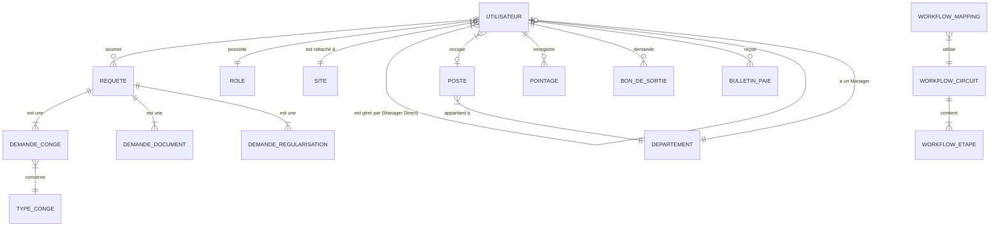

# Core Database Entities & Relationships

This document focuses on the primary entities of the SomePharm HR Portal and how they relate to one another.

## Entity Relationship Diagram (High-Level)

---

## 1. Core Human Resources
### **Utilisateur** (User / Employee)
The central entity representing every person in the system.
- **Key Relationships:**
    - `role`: Many-to-One with **Role**.
    - `site`: Many-to-One with **Site**.
    - `managerDirect`: Many-to-One with **Utilisateur** (Self-referencing for hierarchy).
    - `departement`: String field (linked logically to Departement).

### **Departement** & **Poste**
- **Departement**:
    - `manager`: One-to-One with **Utilisateur** (The head of the department).
- **Poste**:
    - `departement`: Many-to-One with **Departement**.

---

## 2. Request & Workflow System
### **Requete** (Abstract Request)
Parent class for all employee requests.
- **Key Relationships:**
    - `demandeur`: Many-to-One with **Utilisateur** (The person asking).
- **Children (Inheritance):**
    - **DemandeConge**: Linked to `TypeConge`.
    - **DemandeDocument**: Linked to specific document types.
    - **DemandeRegularisation**: Linked to a specific `Pointage`.

### **Workflow Engine**
- **WorkflowCircuit**: Defines a sequence of approval steps.
- **WorkflowEtape**: Individual step (e.g., "Manager Approval").
    - `circuit`: Many-to-One with **WorkflowCircuit**.
- **WorkflowMapping**: Connects a request type (e.g., "CONGE") to a specific **WorkflowCircuit**.

---

## 3. Operational Entities
### **Pointage** (Attendance)
- **Key Relationships:**
    - `employe`: Many-to-One with **Utilisateur**.

### **BonDeSortie** (Exit Permit)
- **Key Relationships:**
    - `demandeur`: Many-to-One with **Utilisateur**.
    - `idRequeteOrigine`: Logical link to the approved **Requete**.

### **BulletinPaie** (Payroll)
- **Key Relationships:**
    - `employe`: Many-to-One with **Utilisateur**.

---

## 4. Master Data (Reference Tables)
- **Role**: Defines access levels (ADMIN, MANAGER, EMPLOYE, etc.).
- **TypeConge**: Defines leave rules (Annual, Sick, etc.) and quotas.
- **Site**: Physical locations of the company.
- **JourFerie**: Public holidays used for leave balance calculations.
